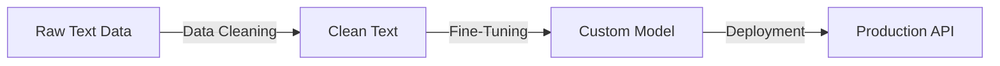

# 🚀 GenAI Cohort Labs: Data Cleaning & Fine-Tuning Workshop

[](https://colab.research.google.com/github/muhammadibrahim313/genai-cohort-labs/blob/main/text_data_cleaning.ipynb)
[](https://opensource.org/licenses/MIT)
[](https://www.python.org/downloads/)

## 📚 About

Complete hands-on workshop materials for **Data Cleaning** and **Fine-Tuning** Large Language Models. Created for the GenAI Cohort session in collaboration with **Pak Angels** and **iCode**.

Transform raw text into production-ready AI models in just 2 hours! 🎯

## 🎯 What You'll Learn

### 📓 Notebook 1: Text Data Cleaning
- **8 essential cleaning techniques** for NLP
- Remove HTML, handle contractions, normalize text
- Process 50K IMDB movie reviews
- Visualize cleaning impact with word clouds
- Save clean data for model training

### 📓 Notebook 2: Fine-Tuning LLMs
- Load pre-trained **DistilBERT** model
- Fine-tune on sentiment analysis task
- Achieve **90%+ accuracy** in minutes
- Deploy to Hugging Face Hub
- Test with custom inputs

## 🚀 Quick Start

1. **Clone the repository**
```bash
git clone https://github.com/muhammadibrahim313/genai-cohort-labs.git
cd genai-cohort-labs
```

2. **Open in Google Colab** (Recommended)
- [Data Cleaning Notebook](https://colab.research.google.com/github/muhammadibrahim313/genai-cohort-labs/blob/main/text_data_cleaning.ipynb)
- [Fine-Tuning Notebook](https://colab.research.google.com/github/muhammadibrahim313/genai-cohort-labs/blob/main/fine_tuning.ipynb)

3. **Run locally**
```bash
pip install -r requirements.txt
jupyter notebook
```

## 📊 Dataset

Using the **IMDB Movie Reviews Dataset** (50K reviews)
- Binary sentiment classification (positive/negative)
- Perfect for learning text processing and fine-tuning
- [Download from Kaggle](https://www.kaggle.com/datasets/lakshmi25npathi/imdb-dataset-of-50k-movie-reviews)

## 🛠️ Technologies Used

- **Python 3.8+**
- **Transformers** (Hugging Face)
- **PyTorch**
- **NLTK** for text processing
- **Pandas**, **NumPy** for data handling
- **Matplotlib**, **Seaborn** for visualization

## 📈 Results

- **Data Cleaning**: Reduce text by ~40% while preserving meaning
- **Fine-Tuning**: Achieve 90%+ accuracy in sentiment analysis
- **Deployment**: Model available on Hugging Face Hub

## 🎓 Learning Path



## 💡 Use Cases

Apply these techniques to:
- 🏭 Equipment maintenance logs
- 📊 Customer feedback analysis
- 📄 Document classification
- 🔧 Technical report categorization
- 💬 Chatbot training

## 🤝 Contributing

Contributions welcome! Feel free to:
- Report issues
- Suggest improvements
- Submit pull requests

## 📝 License

MIT License - feel free to use in your own projects!

## 🙏 Acknowledgments

- **Pak Angels** & **iCode** for organizing
- **Hugging Face** for amazing tools
- Workshop participants for valuable feedback

## 📬 Contact

**Muhammad Ibrahim**
- GitHub: [@muhammadibrahim313](https://github.com/muhammadibrahim313)
- LinkedIn: [Your LinkedIn]

---

**⭐ Star this repo if you found it helpful!**

**🔄 Fork to create your own version!**

